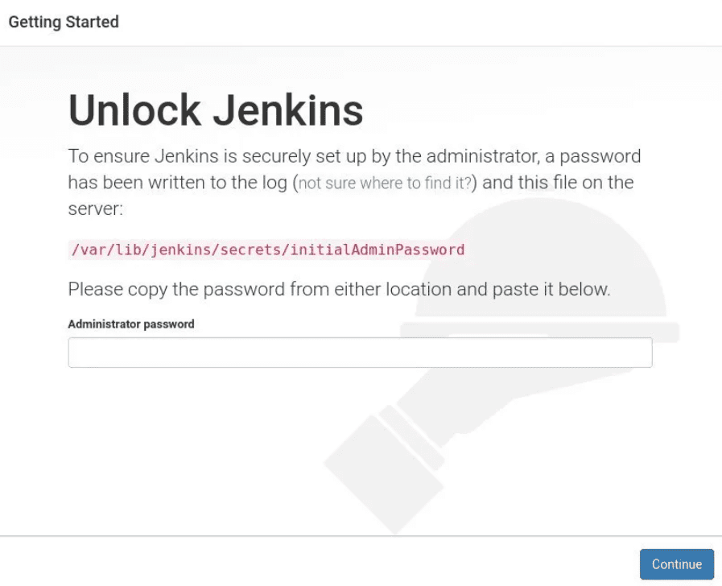
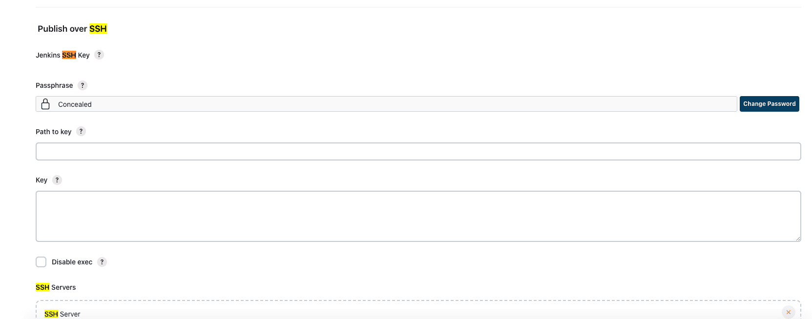

在 Ubuntu 18.04 安装jenkins，部署vue项目

# 1.安装jenkins
## 1.安装java
~~~
sudo apt update
sudo apt install openjdk-11-jdk
java -version
sudo vim /etc/environment # JAVA_HOME="/usr/lib/jvm/java-11-openjdk-amd64"
source /etc/environment
echo $JAVA_HOME
~~~
## 2. 安装jenkins
~~~
# 导入 Jenkins 软件源的 GPG keys：
wget -q -O - https://pkg.jenkins.io/debian/jenkins.io.key | sudo apt-key add -
# 添加软件源到系统中
sudo sh -c 'echo deb http://pkg.jenkins.io/debian-stable binary/ > /etc/apt/sources.list.d/jenkins.list'

sudo apt update
sudo apt install jenkins
systemctl status jenkins
~~~
## 3.配置Jenkins
打开浏览器,输入 http://your_ip_or_domain:8080，可以看到如下界面

用如下命令获取的password
~~~
sudo cat /var/lib/jenkins/secrets/initialAdminPassword
~~~
然后继续，install suggested plugins ,继续下一步，按提示操作即可

# 2.安装nginx

~~~
sudo apt install nginx
sudo systemctl status nginx
sudo nginx -t #查看配置文件位置，后面vue项目build之后的dist文件夹下内容，直接拷贝到默认配置指向的80端口，/var/www/html目录下即可
~~~

# 3.部署前端项目（github）
## 1.安装jenkins插件
点开左侧系统管理(Manage Jenkins)-插件管理-Available
* NodeJS Plugin 最好添加一个跟服务器版本一致的 NodeJS 版本
* Publish Over SSH 
点击Intall without restart，等待安装即可
## 2.配置github
点击右侧头像-settings-Developer settings/Personal access tokens (classic)-Generate new token 拷贝对应的值，并保存(下次看不到了)
## 3.配置Publish Over SSH 
点开左侧系统管理(Manage Jenkins)-Configure System

Passphrase输入ssh对应服务器的用户登录密码
配置 SSH Servers
* Name：随便起
* Hostname：对应服务器的ip 
* Username：对应服务器的登录用户名如(root)
* Remote Directory：/data/jenkins_data/ 用于构建后的操作工作目录

## 4.新建item
输入名字，选择Freestyle Project 点击确认
### 1.General
选择 参数化构建过程，新建字符参数、选项参数、git参数等，按字段填写，填写后，会在构建项目的时候提供选择。
### 2.源码管理
选择git， 地址：
https://第二步配置的github access token @github.com/userxxx/vue-project.git

### 3.Build Steps
选择执行shell
~~~
#!/bin/bash -ilex 
whoami
pnpm -v
pnpm install
~~~
在选择执行shell
~~~
npm run build-only
echo "Completing!"
~~~

点击应用

即可对新增的item项目进行部署build
