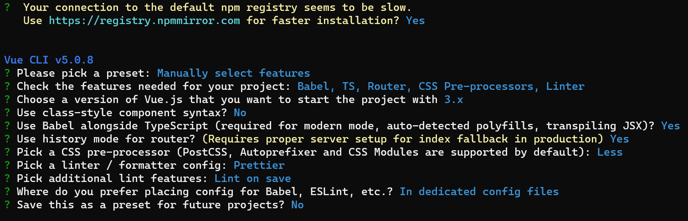

从一台新服务器上，开始配置前端vue开发环境
# 1.选择一台服务器
国内三大厂商：阿里云、腾讯云、华为云。
* 之前一直用阿里云，无奈阿里云太贵了；
* 然后换成了腾讯云，新用户会便宜很多，四百多买了一台4核8g系统盘180g的云服务器(linux)，性价比很高；
* 华为云之前买过windows的，不是新用户，也不便宜。

# 2.配置服务器环境
## 1.配置ssh
~~~
ssh-keygen -t rsa  # 后续参数可以全部不填（填了配置免密可能有问题），直接回车
cd ~/.ssh
ls # id_rsa  id_rsa.pub ,将id_rsa.pub放到github/gitlab，即可拉取提交代码
#配置免密，将本地id_rsa.pub文件内容复制
vim authorized_keys #粘贴之前复制的id_rsa.pub内容即可
# 也可以用命令配置免密 ssh-copy-id root@ip
~~~
## 2.安装node
[ubuntu安装node](https://github.com/nodesource/distributions)
执行如下脚本
~~~
curl -fsSL https://deb.nodesource.com/setup_18.x | sudo -E bash - &&\
sudo apt-get install -y nodejs
node -v # v18.16.0
~~~

配置npm
~~~
npm config ls ## 查看简单的配置项
npm config ls -l  ##　查看所有配置项
npm config get cache  ## 查看缓存配置，get后面可以跟任意配置项
npm config edit  ## 直接编辑config文件，这个会打开文本

sudo npm config set prefix "/data/nodejs/node_global" #全局模式下，软件包安装地方
sudo npm config set cache "/data/nodejs/node_cache" #npm缓存目录
#设置环境变量path，全局模式下安装的包可以用命令执行
echo $PATH
sudo vim /etc/profile #在末尾添加export PATH="/data/nodejs/node_global/bin:$PATH"
#保存执行source
source /etc/profile

sudo npm config set registry https://registry.npm.taobao.org/ #将https://registry.npmjs.org/ 改为taobao镜像源，加快速度
~~~

# 3.远程开发
采用本地的vscode，通过ssh配置连接远程的linux服务器。
vscode 需要安装的插件
~~~
Vue Language Features (Volar) # 识别vue3
Prettier - Code formatter # 前端格式化代码插件
EditorConfig for VS Code # 兼容不同系统的编码风格
GitLens — Git supercharged # git变更可视化插件
~~~

# 4.创建项目
## 1.采用vue-cli创建
~~~
npm install -g @vue/cli
vue create my-project
~~~
选择项如下所示：

## 2.采用create-vue创建vite项目(更新)
npm create vue@3
按照 https://github.com/vuejs/create-vue 文档所示图的选择项(unit-test 和end-to-end test 选择的no，其它的跟文档选择一样) 配置即可

### 1..editorconfig 兼容各系统
~~~
# https://editorconfig.org

root = true

[*]
charset = utf-8
indent_style = space
indent_size = 2
end_of_line = lf
insert_final_newline = true
trim_trailing_whitespace = true

[*.md]
insert_final_newline = false
trim_trailing_whitespace = false
~~~